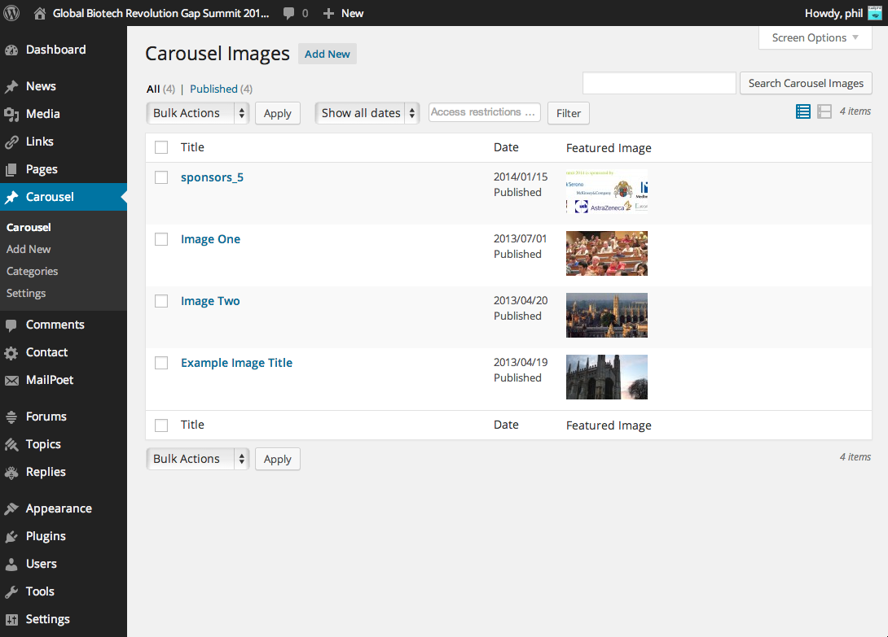
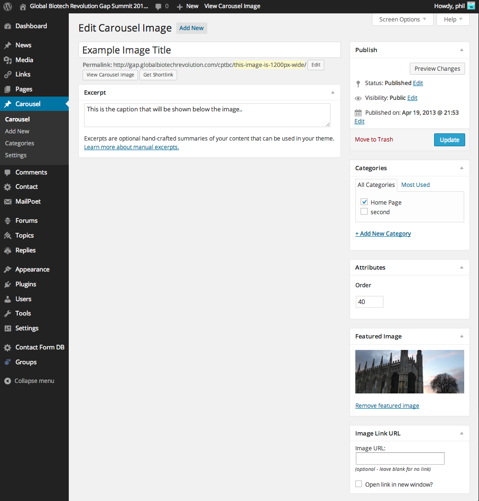

# CPT Bootstrap Carousel
<!--
Contributors: tallphil
Donate Link: http://www.tallphil.co.uk/bootstrap-carousel/
Tags: carousel, slider, image, bootstrap
Requires at least: 3.0.1
Tested up to: 5.4
Requires PHP: 5.2.4
Stable tag: 1.11
License: GPLv2 or later
License URI: http://www.gnu.org/licenses/gpl-2.0.html
-->

A custom post type for choosing images and content which outputs Bootstrap Image Carousel (slider) from the [image-carousel] shortcode.

## Description

A custom post type for choosing images and content which outputs a [carousel](http://getbootstrap.com/javascript/#carousel) from [Twitter Bootstrap](http://www.getbootstrap.com) using the shortcode `[image-carousel]`.

The plugin assumes that you're already using Bootstrap, so you need to load the Bootstrap javascript and CSS separately.

* [Download Twitter Bootstrap](http://getbootstrap.com/)
* [Bootstrap CDN](http://www.bootstrapcdn.com/) _(hotlink CSS and javascript files)_
* [Bootstrap Carousel in action](https://getbootstrap.com/docs/4.4/components/carousel/)

This plugin is available from the WordPress Plugins Directory: [https://wordpress.org/plugins/cpt-bootstrap-carousel/](https://wordpress.org/plugins/cpt-bootstrap-carousel/).
The source code is maintained on GitHub: [https://github.com/ewels/cpt-bootstrap-carousel](https://github.com/ewels/cpt-bootstrap-carousel).

### Shortcode Options
As of version 1.5, nearly all of these options can be set in the CPT Bootstrap Carousel Settings page. However, if you'd like different settings for different carousels, you can override these by using shortcode options...

* `interval` _(default 5000)_
  * Length of time for the caption to pause on each image. Time in milliseconds.
  * `[image-carousel interval="12000"]`

* `showcaption` _(default true)_
  * Whether to display the text caption on each image or not. `true` or `false`.
  * `[image-carousel showcaption="false"]`

* `showcontrols` _(default true)_
  * Whether to display the control arrows or not. `true` or `false`.
  * `[image-carousel showcontrols="false"]`

* `orderby` and `order` _(default `menu_order` `ASC`)_
  * What order to display the posts in. Uses [WP_Query terms](http://codex.wordpress.org/Class_Reference/WP_Query#Order_.26_Orderby_Parameters).
  * `[image-carousel orderby="rand"]`
  * `[image-carousel orderby="date" orderby="DESC"]`

* `category` _(default all)_
  * Filter carousel items by a comma separated list of carousel category slugs.
  * `[image-carousel category="homepage,highlights"]`

* `id` _(default all)_
  * Specify the ID of a specific carousel post to display only one image.
  * Find the image ID by looking at the edit post link, eg. post 109 would be `/wp-admin/post.php?post=109&action=edit`
  * `[image-carousel id="109"]`

* `twbs` _(default 2)_
  * Output markup for Twitter Bootstrap Version 2 or 3.
  * `[image-carousel twbs="3"]`

### Credits

This plugin was written by @tallphil with help and suggestions from several others including (but not limited to) @reddo, @joshgerdes, @atnon, @grahamharper, @rchq, @oheijo, @smtk, @cla63, @cookierebes and @sipman.

The Serbo-Croation translation was kindly provided by Borisa Djuraskovic from [http://www.webhostinghub.com](http://www.webhostinghub.com)

### Contributing

If you would like to contribute to this plugin, please make a personal fork of the GitHub repository and then submit a pull request. For more details please see the [contributing guide](https://github.com/ewels/CPT-Bootstrap-Carousel/CONTRIBUTING.md).

## Installation

### The easy way

1. Go to the Plugins Menu in WordPress
2. Search for "CPT Bootstrap Carousel"
3. Click 'Install'
4. Activate the plugin

### Manual Installation

1. Download the plugin file from this page and unzip the contents
2. Upload the `cpt-bootstrap-carousel` folder to the `/wp-content/plugins/` directory
3. Activate the `cpt-bootstrap-carousel` plugin through the 'Plugins' menu in WordPress

### Once Activated

1. Make sure that your theme is loading the [Twitter Bootstrap](http://www.getbootstrap.com) CSS and Carousel javascript
2. Place the `[image-carousel]` shortcode in a Page or Post
3. Create new items in the `Carousel` post type, uploading a Featured Image for each.
  * (Optional) You can hyperlink each image by entering the desired url `Image Link URL` admin metabox when adding a new carousel image.

## Frequently Asked Questions

### The carousel doesn't start sliding itself / setting interval doesn't work

This can be caused by having your jQuery and Bootstrap javascript files included in the wrong place.

* Make sure that jQuery is only being included once
* Make sure that the Bootstrap javascript file is being included after jQuery
  * NB: This often means putting it after `wp_head()` in your theme's `header.php` file
* Make sure that both jQuery and Bootstrap are being included in the theme header, not footer
* Make sure that the Bootstrap javascript file is referenced _after_ the jQuery file.

### How do I insert the carousel?

First of all, install and activate the plugin. Go to 'Carousel' in the WordPress admin pages and add some images. Then, insert the carousel using the `[image-carousel]` into the body of any page.

### Can I insert the carousel into a WordPress template instead of a page?

Absolutely - you just need to use the [do_shortcode](http://codex.wordpress.org/Function_Reference/do_shortcode) WordPress function. For example:

```php
echo do_shortcode('[image-carousel]');
```

### I get grey bars at the side of my images / The image isn't aligned (or doesn't reach the far side of the carousel)

This happens when the carousel is bigger than your images. Either upload higher resolution images, or select the "Use background images?" option in the settings (this will stretch the images though, so they may get a little blurry).

### Can I change the order that the images display in?

You can specify the order that the carousel displays images by changing the setting in the Settings page, or by using the `orderby` and `order` shortcode attributes. The settings page has common settings, or you can use any terms described for the [WP_Query orderby terms](http://codex.wordpress.org/Class_Reference/WP_Query#Order_.26_Orderby_Parameters) for the shortcode.

### Can I have different carousels with different images on the same site?

Yes - create a few categories and add your specific images to a specific category. Then, when inserting the shortcode into the page, specify which category you want it to display images from using the `category` shortcode attribute.

### Can I customise the way it looks / works?

The carousel shortcode has a number of attributes that you can use to customise the output. These are described on the main plugin [Description](http://wordpress.org/plugins/cpt-bootstrap-carousel/installation/) page.

### Help! Nothing is showing up at all

1. Is the plugin installed and activated?
2. Have you added any items in the `Carousel` post type?
3. Have you placed the `[image-carousel]` shortcode in your page?

Try writing the shortcode using the 'Text' editor instead of the 'Visual' editor, as the visual editor can sometimes add extra unwanted markup.

### My images are showing but they're all over the place

Is your theme loading the Bootstrap CSS and Javascript? _(look for `bootstrap.css` in the source HTML)_

### The carousel makes the content jump each time it changes

You need to make sure that each image is the same height. You can do this by setting an `Aspect ratio` in the `Edit Image` section of the WordPress Media Library and cropping your images.

## Screenshots

1. Admin list interface showing Carousel images and titles. 
2. Admin image interface showing optional title and caption (Excerpt) fields, along with Category, order, image and URL 
3. Example output. Requires Bootstrap CSS and Javascript to be loaded (see documentation). 


## Changelog

### 1.11

* Added support for crossfading images instead of sliding

### 1.10

* Added support for Bootstrap 4
* Added support for video backgrounds, youtube or vimeo
* Tested with WordPress 5.1.1
* Separated settings option for _Show Caption / Titles?_ into two, one for each.
* Fixed minor front end bug when using background images. Thanks to @thendigital
* New Indonesian translation by Jordan Silaen from [http://chameleonjohn.com/](http://chameleonjohn.com/)
* Many other tweaks and improvements

### 1.9.1

* Titles and captions now show if present, independently of each other (previously both needed to be filled in)
  * You can hide them by leaving blank, or setting _Show Slide Titles / Captions?_ to False in the settings
* New German translation courtesy of @stefan-meier
* `Undefined index` warning fixed by @pfernandez
* Carousel items now have proper CSS IDs (by @chickahoona)
* Fixed bug where interval of 0 was replaced with the default interval time
* Nicer icon in the WordPress admin (thanks @stefan-meier)
* Localization file path issue fixed (thanks @stefan-meier)

### 1.9

* Prevented the help tab from displaying on pages other than Carousel Items
* Made the output buffer cleaning only happen if we have images (thanks @ChrisLomax)
* Tidied up some warnings generated when WP_DEBUG was true
* New settings option to rely on data-attributes only, without any Javascript chunks
* Split the plugin into multiple files to make code easier to maintain
* Rewrote the settings page to be clearer
* Added new feature to have a link button instead of clickable slider image
* Bugfix: Carousel items with links using background images now work.

### 1.8.1

* Bugfix. Apologies to anyone who ran into it and thanks to kylewhenderson for the spot.

### 1.8

* Bumped "tested with" up to `WP 4.0`
* Added new plugin icon and updated the banner + screenshots
* Carousel controls now hidden if there is only one image - thanks to @rchq
* Option to use a different WordPress image size, suggested by oheijo
* Added option to specify HTML tags for caption and title. Suggested by smtk
* New option to use background images instead of `` tags. Good for resizing. Suggested by @cla63 and @cookierebes
* New Serbo-Croatian translation! Thanks to borisa from [http://www.webhostinghub.com](http://www.webhostinghub.com)

### 1.7

* Added custom classes for next/prev buttons - written by @reddo
* Added admin column for categories
* Made the category dropdown in the settings work (bugfix)
* Addeed contextual help on post and page editing screens

### 1.6

* Made the title and caption linked if we have a URL
* Stopped the caption div from displaying if there is not caption
* Added a unique CSS id attribute to each item, based on the wordpress post ID
* Fixed a bug where the plugin was throwing and error when WP_DEBUG was on
* Updated the FAQ a little
* Changed the default version of bootstrap to v3 for new installs. This can be customised in the settings.

### 1.5

* Added new Settings page. Means less shortcode attributes, more user friendly
* Added i18n functions so that the plugin can be translated
* Fix: Bug where featured images were shown on all post types. Noticed by @grahamharper

### 1.4

* Fix: Bug limited carousel to only 10 images. Now displays all images.
* Fix: Specifying interval didn't always worked. Re-written javascript to make it more reliable
* Added `id` shortcode attribute to specify a single image for the carousel
* Restructured the readme file to make usage clearer

### 1.3

* Added support for carousel categories, using filtering with the `category` shortcode
* Added `orderby` shortcode attribute to specify ordering of images
  * This means that images can now be in a random order
* Added `twbs` shortcode attribute to allow the output of Twitter Bootstrap v3 markup
* Added WordPress directory screenshots
* Admin thumbnail images now link to the edit page

### 1.2

* Featured images are now shown in the admin list view
* Added new admin metabox for image url (written by @tallphil, based on code contributed by @atnon)

### 1.1

* Added shortcode attributes (code contributed by @joshgerdes)

### 1.0

* Initial release

## Upgrade Notice

### 1.3

* A bunch of requested features have been added - mainly random ordering and categories. See the changelog for more details.

### 1.2

* Featured images are now shown in the admin list view.
  * Note: This update creates a new thumbnail size. I recommend using the [Regenerate Thumbnails](http://wordpress.org/plugins/regenerate-thumbnails/) WordPress plugin to regenerate all of your image thumbnails.
* Added a new admin metabox to give each image a link (optional).

### 1.1

* Added shortcode attribute functionality for tweaking of carousel options.
